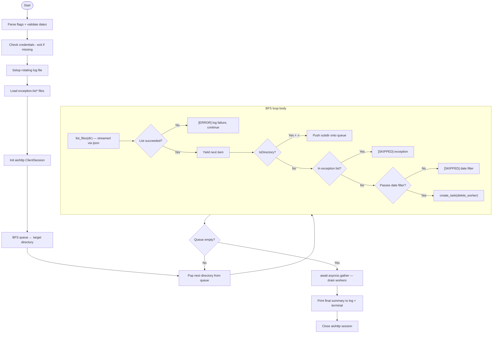

# bunny-scripts

Utility scripts for managing [Bunny CDN](https://bunny.net) storage zones.

---

## delete-files.py

Bulk-deletes files from a Bunny CDN storage zone via the [Edge Storage API](https://docs.bunny.net/api-reference/storage/).
Designed to run for days against large storage zones (90 TB+) without leaking memory or leaving orphaned connections.

**Key characteristics:**

- Async I/O — uses `aiohttp` + `asyncio` so all concurrency is handled in a single process with no forking
- Streaming JSON — uses `ijson` to parse directory listings item-by-item, keeping memory usage O(1) regardless of directory size
- Iterative BFS traversal — no recursion stack; handles arbitrarily deep directory trees
- Rate-limit aware — exponential back-off with jitter on HTTP 429 and 5xx responses
- Exception lists — supports multiple `exception.list*` files; protects exact files and entire directories from deletion
- Rotating logs — writes structured logs to a date-stamped folder, rotating at 100 MB
- Graceful shutdown — Ctrl+C (or SIGTERM) drains in-flight deletes before exiting and always prints a final summary

---

## How It Works



Each `delete_worker` acquires a slot from `asyncio.Semaphore(--workers)` before making
the DELETE request, ensuring at most `N` concurrent API calls at any moment.
Directory listings are streamed through `ijson` item-by-item so large directories never
materialise fully in memory. The BFS queue lives in heap memory, so directory trees of
any depth are handled without hitting Python's recursion limit.

### Path-date fast path

When a directory path contains a `YYYY-MM-DD` segment (e.g. `.../2025-03-14/`), the
script uses the date directly without waiting for the API's `DateCreated` field:

| Condition | Action | API calls saved |
|---|---|---|
| Date fails `--before` / `--since` filter | Skip directory entirely | list + all deletes |
| Date passes filter + no exceptions under dir | Bulk-delete whole directory in one call | list + N−1 deletes |
| Date passes filter + exceptions exist under dir | Fall through to normal per-file listing | none |
| No date in path | Fall through to normal per-file listing | none |

This is most impactful for large date-partitioned storage zones — a directory like
`images/app/ai/illustrator/2025-03-14/` containing 10,000 files goes from
10,001 API calls down to 1.

---

## Requirements

### uv

The script is a self-contained [PEP 723](https://peps.python.org/pep-0723/) inline-dependency script.
[`uv`](https://docs.astral.sh/uv/) resolves and caches `aiohttp` and `ijson` automatically on first run — no virtualenv or `pip install` needed.

**Install uv (Linux / macOS):**

```bash
curl -LsSf https://astral.sh/uv/install.sh | sh
```

Verify:

```bash
uv --version
```

**Python 3.11 or newer is required.** If you don't have it, uv can manage it for you:

```bash
uv python install 3.11
```

---

## Setup

### 1. Make the script executable

```bash
chmod +x delete-files.py
```

### 2. Set credentials

The script reads credentials from three sources in this priority order:

1. **CLI flags** — `--storage-zone`, `--api-key`, `--region` (highest priority)
2. **Shell environment variables** — `BUNNYCDN_STORAGE_ZONE`, `BUNNYCDN_API_KEY`, `BUNNYCDN_REGION`
3. **`.env` file** — loaded automatically if present in the working directory (lowest priority)

**Using a `.env` file (recommended):**

```bash
cp .env.example .env
# then edit .env and fill in your values
```

`.env` is gitignored and never committed. The script loads it automatically — no `source` or `export` needed.

**`.env` format:**

```bash
BUNNYCDN_STORAGE_ZONE=my-storage-zone
BUNNYCDN_API_KEY=xxxxxxxx-xxxx-xxxx-xxxx-xxxxxxxxxxxx
BUNNYCDN_REGION=ny
```

**Regions:**

| Region | Value |
|---|---|
| New York | `ny` |
| Los Angeles | `la` |
| Singapore | `sg` |
| Sydney | `syd` |
| Falkenstein | `de` |

---

## Exception Lists

Before running, create one or more exception list files in the **same directory as the script**.
Any file matching the glob `exception.list*` is loaded and merged automatically.

**Supported file names (examples):**

```
exception.list
exception.list.staging
exception.list.production
```

Each file is a plain text list of CDN URLs — one per line.
Blank lines and lines starting with `#` are ignored.

**Two entry types are supported:**

```
# Exact file — only this specific file is protected
https://cdn.example.com/settings/logo.png

# Directory — every file under this path is protected (trailing slash required)
https://cdn.example.com/settings/
https://cdn.example.com/temporary/
```

Both percent-encoded (`Text%20File.png`) and unencoded (`Text File.png`) URLs are handled
correctly — they normalise to the same key before matching.

> **If no exception list files are found**, the script will pause and ask for confirmation
> before proceeding, warning that static assets may be permanently deleted.

---

## Usage

```
./delete-files.py -d <PATH> [options]
```

### Flags

| Flag | Default | Description |
|---|---|---|
| `-d`, `--directory` | *(required)* | Directory path inside the storage zone to target |
| `-r`, `--recursive` | off | Recurse into all sub-directories |
| `--since YYYY-MM-DD` | — | Only delete files created **on or after** this date |
| `--before YYYY-MM-DD` | *(required)* | Only delete files created **before** this date |
| `--workers N` | `20` | Max concurrent DELETE requests (safe max: ~80) |
| `--progress-every N` | `20` | Refresh the terminal counter every N completed operations |

Both `--since` and `--before` can be combined (AND logic — both conditions must pass).

### Credential flags (override environment variables)

| Flag | Overrides | Description |
|---|---|---|
| `--storage-zone NAME` | `BUNNYCDN_STORAGE_ZONE` | Storage zone name |
| `--api-key KEY` | `BUNNYCDN_API_KEY` | API access key |
| `--region REGION` | `BUNNYCDN_REGION` | Region prefix (`ny`, `la`, `sg`, `syd`, `de`) |

Flag values always take priority over environment variables when both are provided.

### Examples

Delete all files older than one year under `images/`, recursively:

```bash
./delete-files.py -d images/ -r --before 2025-03-05
```

Delete files in a specific date window:

```bash
./delete-files.py -d images/ -r --since 2023-01-01 --before 2024-01-01
```

Delete everything in a single flat directory (no recursion):

```bash
./delete-files.py -d temp-uploads/
```

Increase concurrency for faster throughput (stay under 80 to respect rate limits):

```bash
./delete-files.py -d images/ -r --before 2025-01-01 --workers 50
```

Pass credentials inline without setting environment variables:

```bash
./delete-files.py \
  --storage-zone my-zone \
  --api-key xxxxxxxx-xxxx-xxxx-xxxx-xxxxxxxxxxxx \
  --region ny \
  -d images/ -r --before 2025-01-01
```

---

## Running Long Jobs (tmux recommended)

For multi-day runs, use `tmux` so the session survives disconnection:

```bash
tmux new -s cleanup
export BUNNYCDN_STORAGE_ZONE="my-zone"
export BUNNYCDN_API_KEY="..."
./delete-files.py -d images/ -r --before 2025-03-05
```

Detach with `Ctrl+B D`. Reattach later with:

```bash
tmux attach -t cleanup
```

**Stopping the script:** press `Ctrl+C`. The script will finish any in-flight DELETE
requests, print a final summary, and exit cleanly. No orphaned connections or partial state.

---

## Output

### Terminal (live counter)

A single line is updated in place every `--progress-every` operations:

```
Deleted: 45231 | Skipped: 312 | Errors: 4 | Elapsed: 2h14m03s
```

### Log files

Structured logs are written to a fixed directory created at startup:

```
logs/
  delete-files/
    log-2026-03-05.log        ← active log (rotates at 100 MB)
    log-2026-03-05.log.1      ← most recent rotated backup
```

Each log line is timestamped:

```
2026-03-05T14:23:01  [DELETED]  /images/app/ai/illustrator/2025-01-10/flat_2d-abc.png
2026-03-05T14:23:01  [SKIPPED]  /settings/logo.png (exception)
2026-03-05T14:23:02  [SKIPPED]  /images/recent/photo.jpg (date filter)
2026-03-05T14:23:05  [ERROR]    /images/broken/file.png
2026-03-05T14:25:00  [SUMMARY]  Deleted: 200 | Skipped: 12 | Errors: 1 | Elapsed: 0h02m00s
```

Follow the log in real time from another tmux pane:

```bash
tail -f logs/delete-files/log-2026-03-05.log
```

---

## Rate Limits

Bunny CDN allows up to [100 concurrent connections per storage zone](https://docs.bunny.net/storage/limits).
The default `--workers 20` is conservative. The script automatically backs off on HTTP 429
responses using exponential back-off (up to ~32 seconds) with random jitter to prevent
thundering herd across workers.
